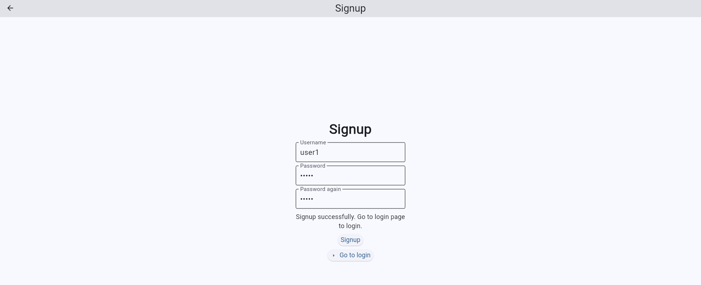
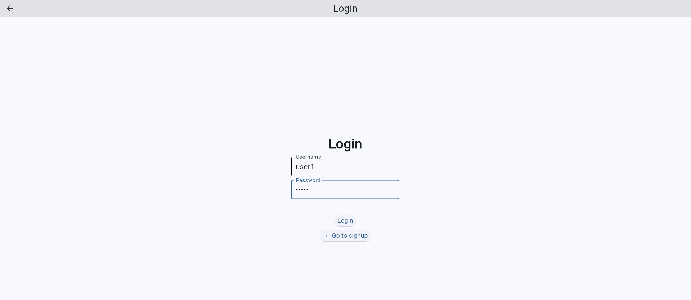
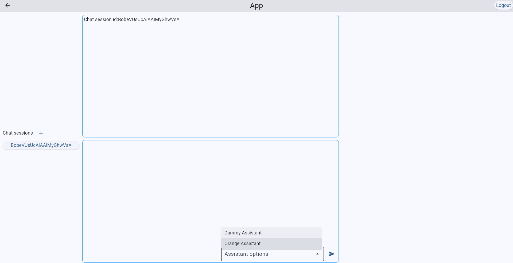
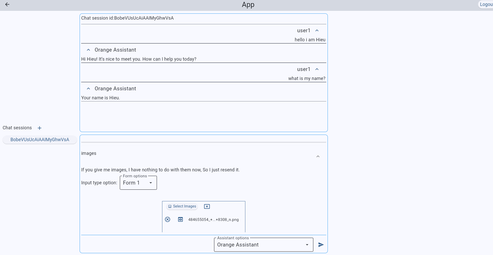
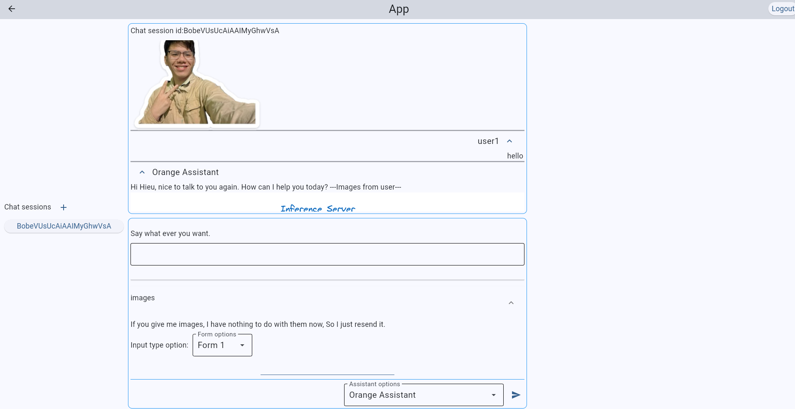
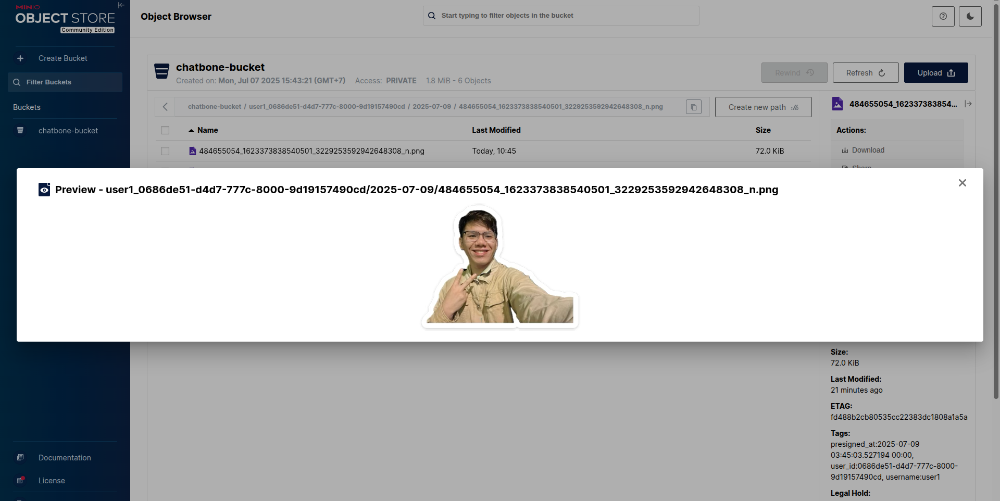

# Chatbone Project

---

## Overview

Platform for serving AI agents end to end. You just focus on the logic, bring it to client is ours.

## 🚀 Quick Start

### Prerequisites

Before you begin, ensure you have the following installed on your system:

1. **Docker:** The current development environment uses Docker to run required background services (like Database,
   Redis, Storage, etc.)
   and project's backend service like datastore app, auth app.
    * [Install Docker Desktop](https://docs.docker.com/desktop/)

2. **uv (Python Package Installer):** We use `uv` for fast and reliable Python package management.
    * [Install uv](https://docs.docker.com/desktop/)

### 1. Clone the project

```bash
git clone https://github.com/hieubnt235/chatbone.git
```

### 2. Install dependencies

In the project root path (where contain root `pyproject.toml`), run:

```bash
uv sync --all-packages
```

This will create new `.venv` and install packages for all workspaces.
If you want to use current `.venv`, ensure it's already activated and run command:

```bash
uv sync --all-packages --active
```

### 3. Run all backend services

```bash
docker compose -f deployments/docker-compose.backend.yaml up --build 
```

This will run five services:

1. **SQL database**: Postgres is current one.
2. **Redis-Stack**: This project need Redis-Json and Redis-Stream
3. **Object storage**: For saving media file, Minio is the current one.
4. **datastore app**: Project's application for database management.
5. **auth app**: Project's application for authentication management.

For more details, look at `deployments/docker-compose.backend.yaml`.  
Make sure all the services running, use your bias docker tools to monitor that, something like this:

```bash
2025-07-09T02:56:59.422736422Z INFO:     Started server process [10]
2025-07-09T02:56:59.422817806Z INFO:     Waiting for application startup.
2025-07-09T02:56:59.423242876Z INFO:     Application startup complete.
2025-07-09T02:56:59.426997678Z INFO:     Uvicorn running on http://0.0.0.0:8000 (Press CTRL+C to quit)
```
Note: With all the following commands from now, you can leave out the `uv run` prefix if you are activating.
If you are not activating and want to activate the new environment you just created (by `uv sync` before)
then run this:
```bash
source .venv/bin/activate
```
Now you use something like `chatbonectl build` instead of `uv run chatbonectl build`.

### 4. Migration database (For the first time setup)

You must ensure that database service is running, then run this command at root project:

```bash
uv run chatbonectl datastore setup
```

### 5. Setup assistants environment

- Note that assistant is written by the others, we are the one who serve what they are wrote,
  so they need to provide all environment variables, API keys (Or we can make the proxy in the future).
- But for now (dev phase), we wrote assistant ourselves, we provide everything for them.
- The `Orange` and `Dummy` example assistants need Gemini API keys, create a free one at
  [this link](https://aistudio.google.com/app/apikey).

Make sure you exported your environment variables and API keys before run, you should
embed it in your favorite terminals.

```bash
export GOOGLE_API_KEY=THIS_IS_YOUR_GOOGLE_GEMINI_API_KEY
echo $GOOGLE_API_KEY
```

Console show:

```bash
THIS_IS_YOUR_GOOGLE_GEMINI_API_KEY
```


### 6. Build Assistants

All assistants will be defined in `assistants` workspace, and declare `assistants-compose.toml` in `assistants`
package.  
At the root of project, run:

```bash
uv run chatbonectl build
```

When built successfully, console show like this:

```bash
Built serve config successfully
Run command:
serve run /home/hieu/Workspace/projects/chatbone/chatbone_serve.yaml

*Note: Export necessary environment variables, or clean the Ray cluster before run ('ray stop -f').
```

It will create the serve file, by default named `chatbone_serve.yaml` and placed at root project.


### 7. Run


Then run apps with command, change the file path to `/your/file/path/to/serve_file.yaml`:

```bash
uv run serve run /home/hieu/Workspace/projects/chatbone/chatbone_serve.yaml
```

or if you build in the root, just run:

```bash
uv run serve run chatbone_serve.yaml
```
To ensure that everything is clear before you serve, run this:
```bash
uv run ray stop -f && uv run serve run chatbone_serve.yaml
```
By default, the app is running at port `9999`. See details in built serve file.

Home, Signup and Login View:




Chat view, you should use `Orange Assistant` for now, the `Dummy` just for testing intentionally.

`Orange Assistant` is just basic assistant do something like:
1. **Compose context**: When you chat, it collects all previous chat context, call summary them, then save the summary
along with messages to make data segment.
2. **Collect context**: Collect context for the chat model, this is the one you just composed in
the first step, and can be also others previous chat context, you can do some processing here.
3. **Chat**: Simply call chat model with new message along with context you collected.

You can also send images for input, but for now it do nothing, just for demo. It actually just 
saves your images in data store and resend the images at the end of response. But from now, you
can do everything with images internally if you want.





You can see that they remember my name =))
You can monitor Minio object storage by access `localhost:9001`, login with username=`hieu`, password=`hieu2352001`
or you can change your own by changing the `docker-compose.backend.yaml`



Now you can make more assistant, starting by `Orange Assistant`. 
